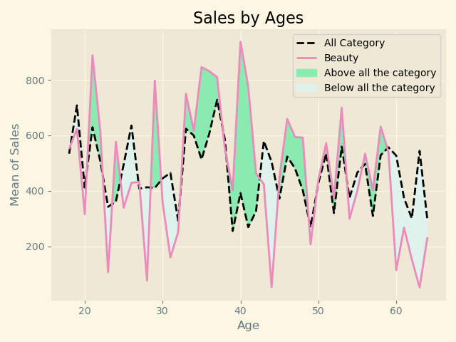
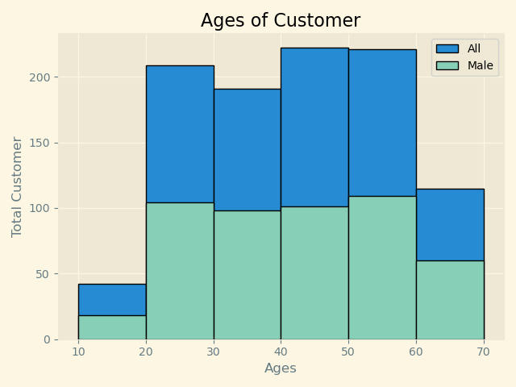
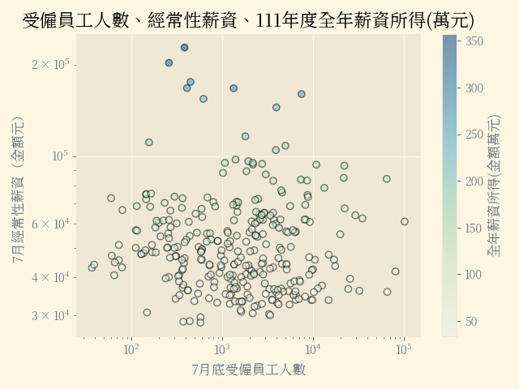
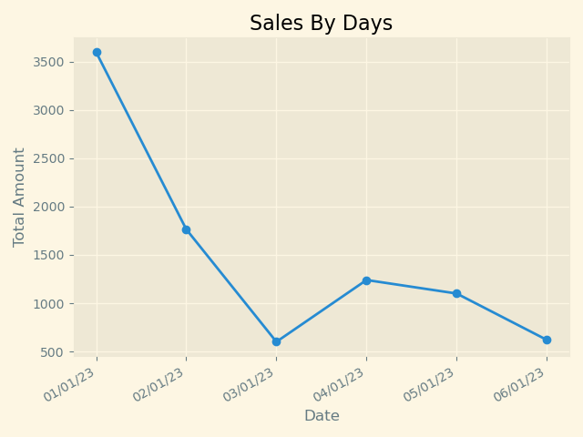
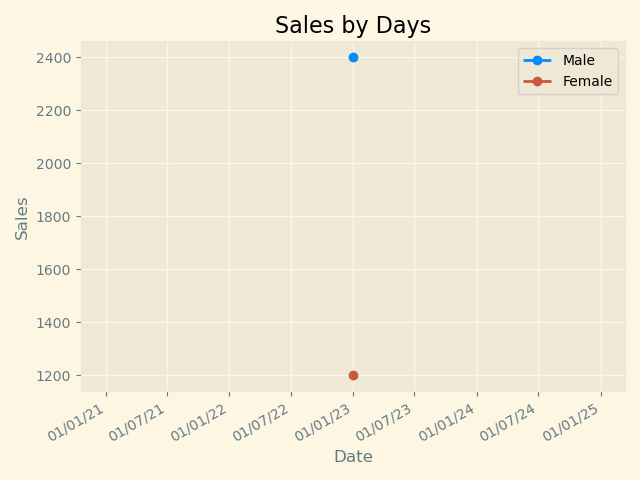
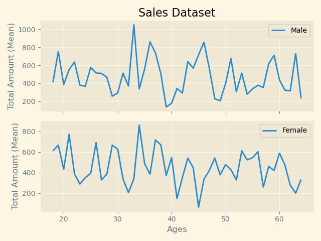

# Learning Python Matplotlib

Reference: [Matplotlib Tutorial](https://youtube.com/playlist?list=PL-osiE80TeTvipOqomVEeZ1HRrcEvtZB_&si=ylA_tihRvx0JxJ1f)

Environment:

- `matplotlib==3.10.0`

Table of contents:

- [Learning Python Matplotlib](#learning-python-matplotlib)
  - [Link](#link)
    - [Dataset](#dataset)
  - [Notes](#notes)
    - [Chapter01 基礎應用](#chapter01-基礎應用)
    - [Chapter02 Bar Chart](#chapter02-bar-chart)
    - [Chapter03 Pie Chart](#chapter03-pie-chart)
    - [Chapter04 Stack Plot](#chapter04-stack-plot)
    - [Chapter05 Lie Plot \& Fill Up](#chapter05-lie-plot--fill-up)
    - [Chapter06 Histogram](#chapter06-histogram)
    - [Chapter07 Scatter Plot](#chapter07-scatter-plot)
    - [Chapter08 Datetime Plot](#chapter08-datetime-plot)
    - [Chapter09 Real-Time Plot](#chapter09-real-time-plot)
    - [Chapter10 Subplots](#chapter10-subplots)

---

## Link

- [matplotlib - Format Strings](https://matplotlib.org/stable/api/_as_gen/matplotlib.pyplot.plot.html): `fmt='[marker][line][color]'`
- [matplotlib - Style sheet](https://matplotlib.org/stable/gallery/style_sheets/style_sheets_reference.html): 提供內建的可用樣式，使用`plt.style.use(STYLE)`
- [Google Font - LXGW WenKai TC](https://fonts.google.com/specimen/LXGW+WenKai+TC?lang=zh_Hant)
- [matplotlib - Colormaps](https://matplotlib.org/stable/users/explain/colors/colormaps.html)
- [Python - Datetime](https://docs.python.org/3/library/datetime.html#datetime.datetime.strftime)
  - [W3School - Python - Datetime](https://www.w3schools.com/python/python_datetime.asp)
- [Pandas - MultiIndex](https://pandas.pydata.org/docs/user_guide/advanced.html)
- [matplotlib - Animation](https://matplotlib.org/stable/users/explain/animations/animations.html)

### Dataset

- [Tutorial - data.csv](https://github.com/CoreyMSchafer/code_snippets/blob/master/Python/Matplotlib/02-BarCharts/data.csv)
- [受僱員工人數、每人薪資-專業、科學及技術服務業(按職類別分)](https://data.gov.tw/dataset/41695)
- [南部科學園區從業員工年齡統計](https://data.gov.tw/dataset/91882)
- [Sales Dataset](https://www.kaggle.com/datasets/sahilislam007/sales-dataset)

## Notes

### Chapter01 基礎應用

- [基礎練習 - Line Chart](./Chapter01/main.py): 單/多線條圖繪製，包含Style設定。
- [自己練習 - Line Chart](./Chapter01/practice.py)

### Chapter02 Bar Chart

- [基礎練習 - Bar Chart](./Chapter02/main.py): Stack Bar Chart, Bar & Line Chart
- [自己練習 - Bar Chart](./Chapter02/practice.py): Horizontal Bart chart

### Chapter03 Pie Chart

- [基礎練習 - Pie Chart](./Chapter03/main.py): Pie Chart, 以及各項參數設定。
- [自己練習 - Pie Chart](./Chapter03/practice.py): 使用[Kaggle’s Most Upvoted Datasets](https://www.kaggle.com/datasets/ritalin56/kaggles-most-upvoted-datasets-overview/data)，取Upvote數量最高的前5名。

### Chapter04 Stack Plot

- [基礎練習 - Stack Chart](./Chapter04/main.py): Pie Chart, 以及各項參數設定。
- [自己練習 - Stack Chart](./Chapter04/practice.py): 使用[南部科學園區從業員工年齡統計](./docs/424_2.csv)，split 111 to 112年資料以製作stack plot。

### Chapter05 Lie Plot & Fill Up

> Reference: https://matplotlib.org/stable/api/_as_gen/matplotlib.axes.Axes.fill_between.html#matplotlib.axes.Axes.fill_between

- [基礎練習 - Line Chart & Fill Up](./Chapter05/main.py): 折線圖，加上與其他Array進行比較，並填滿指定顏色。
- [自己練習 - Line Chart & Fill Up](./Chapter05/practice.py): 使用[Sales Dataset](./docs/Sales Dataset.csv)，取出`All Product Category` & `Beauty`這2個分類進行比較。

### Chapter06 Histogram

- [基礎練習 - Histogram](./Chapter06/main.py): 折線圖，加上與其他Array進行比較，並填滿指定顏色。
- [自己練習 - Histogram](./Chapter06/practice.py): 使用[Sales Dataset](./docs/Sales Dataset.csv)，取出`All Gender` & `Male`這2個分類進行比較。

### Chapter07 Scatter Plot

- [基礎練習 - Scatter](./Chapter07/main.py): 散布圖，教學中使用[2019-05-31-data](./docs/2019-05-31-data.csv)，該資料是YouTube Top 200 Trending Video。
- [自己練習 - Scatter](./Chapter07/practice.py)

### Chapter08 Datetime Plot

- [基礎練習 - Datetime(X axis)](./Chapter08/main.py): 教學是使用`plt.plot_date()`，但該function在3.9版已棄用，所以改成用`plot`方法繪圖。
- [自己練習 - Datetime(X axis)](./Chapter08/practice.py): 使用[Sales Dataset](./docs/Sales%20Dataset.csv)，將資料依照`Date`進行ascending排序，再用`groupby`計算每一天的Total Amount，最後用`head()`取前6天的數據。

### Chapter09 Real-Time Plot

- [基礎練習 - Real-Time Plot](./Chapter09/main.py): 教學是使用`itertools.count`與`random`進行繪製動態圖。
- [自己練習 - Real-Time Plot](./Chapter09/practice.py): 使用[Sales Dataset](./docs/Sales%20Dataset.csv)，與**Chapter08**合併製作，將資料依照`Date`進行ascending排序，再用`groupby`計算每日的Total Amount，並用slice`[:current_cnt]`，取得每一次更新的數據(以日期更新)，以繪製動態圖。

### Chapter10 Subplots

- [基礎練習 - Subplots](./Chapter10/main.py): 使用`plt.subplots()`方法建立多個axes(子視圖)，並共用相同X軸。
- [自己練習 - Subplots](./Chapter10/practice.py): 使用[Sales Dataset](./docs/Sales%20Dataset.csv)，依照`Age, Gender`進行`groupby`，計算Total Amount的Mean，並進行繪圖。

