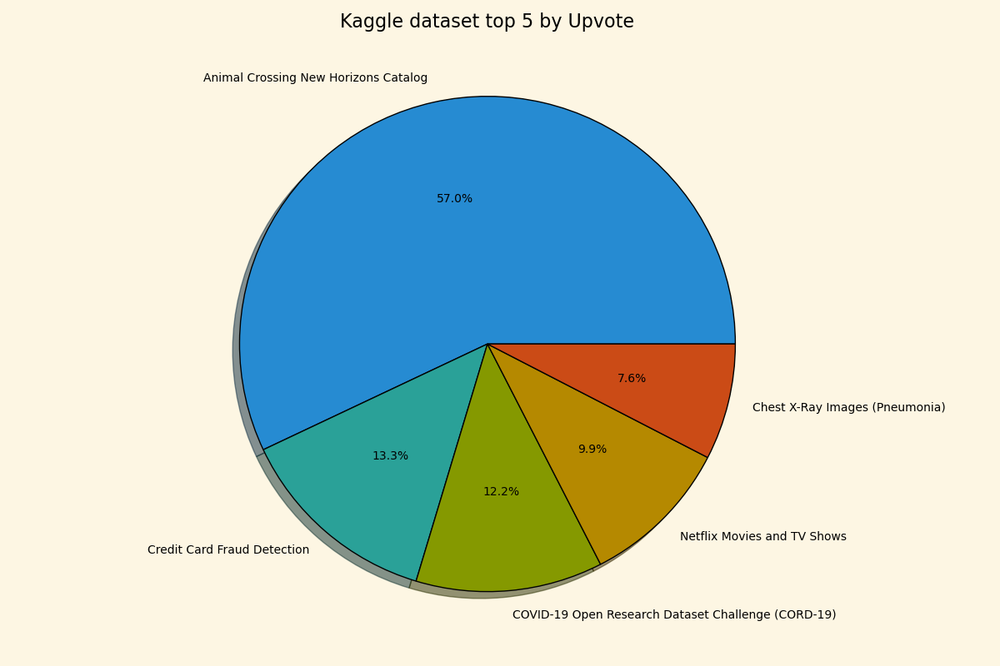

# Learning Python Matplotlib

Reference: [Matplotlib Tutorial](https://youtube.com/playlist?list=PL-osiE80TeTvipOqomVEeZ1HRrcEvtZB_&si=ylA_tihRvx0JxJ1f)

Table of contents:

- [Learning Python Matplotlib](#learning-python-matplotlib)
  - [Link](#link)
    - [Dataset](#dataset)
  - [Notes](#notes)
    - [Chapter01 基礎應用](#chapter01-基礎應用)
    - [Chapter02 Bar Chart](#chapter02-bar-chart)
    - [Chapter03 Pie Chart](#chapter03-pie-chart)
    - [Chapter04 Stack Plot](#chapter04-stack-plot)

---

## Link

- [matplotlib - Format Strings](https://matplotlib.org/stable/api/_as_gen/matplotlib.pyplot.plot.html): `fmt='[marker][line][color]'`
- [matplotlib - Style sheet](https://matplotlib.org/stable/gallery/style_sheets/style_sheets_reference.html): 提供內建的可用樣式，使用`plt.style.use(STYLE)`
- [Google Font - LXGW WenKai TC](https://fonts.google.com/specimen/LXGW+WenKai+TC?lang=zh_Hant)

### Dataset

- [Tutorial - data.csv](https://github.com/CoreyMSchafer/code_snippets/blob/master/Python/Matplotlib/02-BarCharts/data.csv)
- [受僱員工人數、每人薪資-專業、科學及技術服務業(按職類別分)](https://data.gov.tw/dataset/41695)
- [南部科學園區從業員工年齡統計](https://data.gov.tw/dataset/91882)

## Notes

### Chapter01 基礎應用

- [基礎練習 - Line Chart](./Chapter01/main.py): 單/多線條圖繪製，包含Style設定。
- [自己練習 - Line Chart](./Chapter01/practice.py)

### Chapter02 Bar Chart

- [基礎練習 - Bar Chart](./Chapter02/main.py): Stack Bar Chart, Bar & Line Chart
- [自己練習 - Bar Chart](./Chapter02/practice.py): Horizontal Bart chart

### Chapter03 Pie Chart

- [基礎練習 - Pie Chart](./Chapter03/main.py): Pie Chart, 以及各項參數設定。
- [自己練習 - Pie Chart](./Chapter03/practice.py): 使用[Kaggle’s Most Upvoted Datasets](https://www.kaggle.com/datasets/ritalin56/kaggles-most-upvoted-datasets-overview/data)，取Upvote數量最高的前5名。

### Chapter04 Stack Plot

- [基礎練習 - Stack Chart](./Chapter04/main.py): Pie Chart, 以及各項參數設定。
- [自己練習 - Stack Chart](./Chapter04/practice.py): 使用[南部科學園區從業員工年齡統計](./docs/424_2.csv)，split 111 to 112年資料以製作stack plot。

